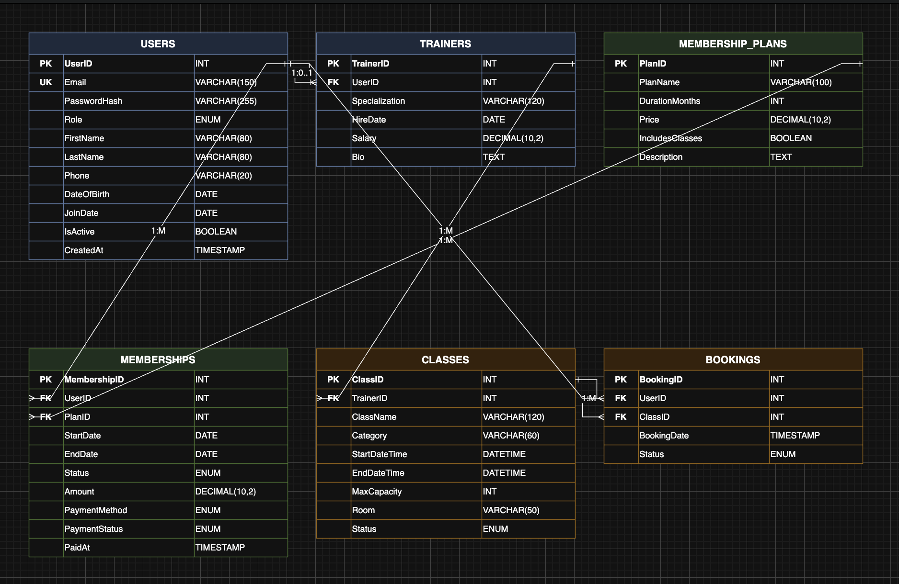

# Gym Management System — Backend

Node.js + Express API for GymCore. Talks to MySQL, uses JWTs for auth, and splits users into three roles: admin, trainer, and member.

## Database diagram



---

## Setup

You need Node.js 18+ and a local MySQL 8 server running.

**1. Copy the env file and fill in your MySQL credentials**

```bash
cp .env.example .env
```

Open `.env` and update `DB_USER` and `DB_PASSWORD` to match your local MySQL setup. Everything else can stay as-is for development.

**2. Install dependencies**

```bash
npm install
```

If `bcrypt` fails to build (native module, needs build tools), swap it for `bcryptjs` in `package.json` — it's a drop-in replacement and works with the same password hashes.

**3. Create the database**

```bash
npm run db:setup
```

This runs the two SQL files in `db/`. The first one creates the `gym_db` database from scratch (it drops it first if it already exists), and the second one inserts 14 test users — 1 admin, 3 trainers, 10 members, all with Albanian names from Kosovo. Every test account has the password `password123`.

> If you change the schema later, just run `npm run db:setup` again. It'll wipe and rebuild the whole database.

**4. Start the dev server**

```bash
npm run dev
```

Runs on `http://localhost:3000`. Nodemon restarts it automatically when you save a file.

---

## Folder structure

```
src/
  server.js         entry point — starts the HTTP listener
  app.js            wires up all the middleware and routes

  config/
    env.js          reads .env and crashes early if something's missing
    db.js           creates the MySQL connection pool

  routes/           maps URLs to controllers
  controllers/      reads the request, calls a service, sends back the response
  services/         business logic lives here — auth, queries, transactions
  models/           raw SQL queries, one file per table
  middleware/       runs before controllers (auth checks, input validation)
  validators/       Zod schemas that define what valid request data looks like
  utils/            small helpers used across the app
```

The request always flows in one direction: **routes → middleware → controller → service → model → database**. None of the layers skip ahead or reach back.

---

## How a request flows through the app

Take `POST /api/auth/login` as an example:

1. Express matches the route in `routes/auth.routes.js`
2. `validate(loginSchema)` runs first — it checks that `email` and `password` are in the body and look right. If not, the request stops here and sends back a 400 with a list of what's wrong.
3. `loginController` runs — it pulls the validated fields and hands them to `login()` in the service.
4. `auth.service.js` queries the database through `user.model.js`, compares the password with bcrypt, and if everything's fine, signs a JWT.
5. The controller calls `sendSuccess()` which sends `{ success: true, data: { token, user }, message: "..." }`.
6. If anything throws along the way, `asyncHandler` catches it and passes it to `errorHandler`, which figures out the right HTTP status code.

Every response from this API has the same shape:

```json
{ "success": true/false, "data": {}, "message": "...", "error": "..." }
```

Either `data` is there (it worked) or `error` is there (it didn't).

---

## Auth endpoints

**Register** — creates a new member account. Role is always `member`; you can't assign yourself admin or trainer through this endpoint.

```
POST /api/auth/register
Content-Type: application/json

{
  "email": "arta.berisha@gmail.com",
  "password": "atleast8chars",
  "firstName": "Arta",
  "lastName": "Berisha",
  "phone": "+38344123456"   (optional, must be +383XXXXXXXX format)
}
```

**Login** — returns a JWT token.

```
POST /api/auth/login
Content-Type: application/json

{
  "email": "admin@bbrosgym.com",
  "password": "password123"
}
```

The token is in `data.token`. You'll need to send it in the `Authorization` header for any protected route.

**Get current user** — returns the logged-in user's profile.

```
GET /api/auth/me
Authorization: Bearer <your token>
```

### Test accounts (from seed data)

| Role    | Email                           | Password     |
|---------|---------------------------------|--------------|
| Admin   | admin@bbrosgym.com              | password123  |
| Trainer | petrit.maliqi@bbrosgym.com      | password123  |
| Trainer | saranda.krasniqi@bbrosgym.com   | password123  |
| Member  | egzon.krasniqi@gmail.com        | password123  |
| Member  | blerta.hoxha@gmail.com          | password123  |

---

## How auth and roles work

The JWT payload is `{ sub: userId, role, email }`. When a route needs authentication, the `authenticate` middleware reads the `Authorization: Bearer ...` header, verifies the token, and attaches `req.user` to the request.

For role-based access, stack `authorize` after `authenticate`:

```js
// only admins can hit this
router.delete('/plans/:id', authenticate, authorize('admin'), deletePlan);

// both admins and trainers can hit this
router.get('/classes/mine', authenticate, authorize('admin', 'trainer'), getMyClasses);
```

If the token is missing or expired you get a 401. If the token is valid but the role is wrong, you get a 403.

---

## Adding a new feature

Every feature follows the same pattern. Say you're adding membership plans:

1. **`src/validators/plan.schema.js`** — Zod schema for the request body
2. **`src/models/plan.model.js`** — SQL queries (`findAll`, `findById`, `create`, etc.)
3. **`src/services/plan.service.js`** — business logic that calls the model
4. **`src/controllers/plan.controller.js`** — reads `req.validated`, calls the service, calls `sendSuccess()`
5. **`src/routes/plan.routes.js`** — wire up the routes with the right middleware
6. **`src/routes/index.js`** — add `router.use('/plans', planRoutes)`

Keep each file under around 300 lines. If a service is getting large, it's probably doing too much.

---

## Environment variables

| Variable         | Description |
|------------------|-------------|
| `PORT`           | Port to listen on (default `3000`) |
| `DB_HOST`        | MySQL host (usually `localhost`) |
| `DB_PORT`        | MySQL port (usually `3306`) |
| `DB_USER`        | MySQL username |
| `DB_PASSWORD`    | MySQL password |
| `DB_NAME`        | Database name (`gym_db`) |
| `JWT_SECRET`     | Signs the tokens — must be at least 32 characters |
| `JWT_EXPIRES_IN` | Token lifetime, e.g. `1d` or `7d` |
| `JWT_ISSUER`     | Label embedded in the token (default `gym-api`) |

`.env` is gitignored. `.env.example` is committed and serves as the template — never put real secrets in it.
